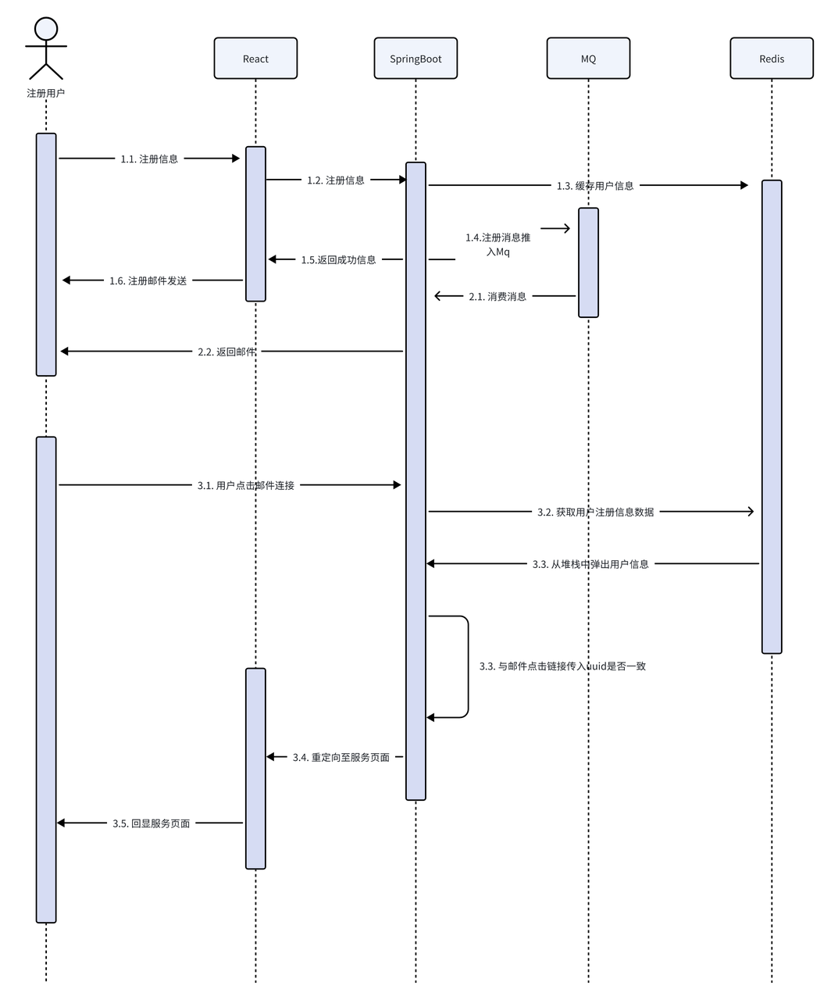
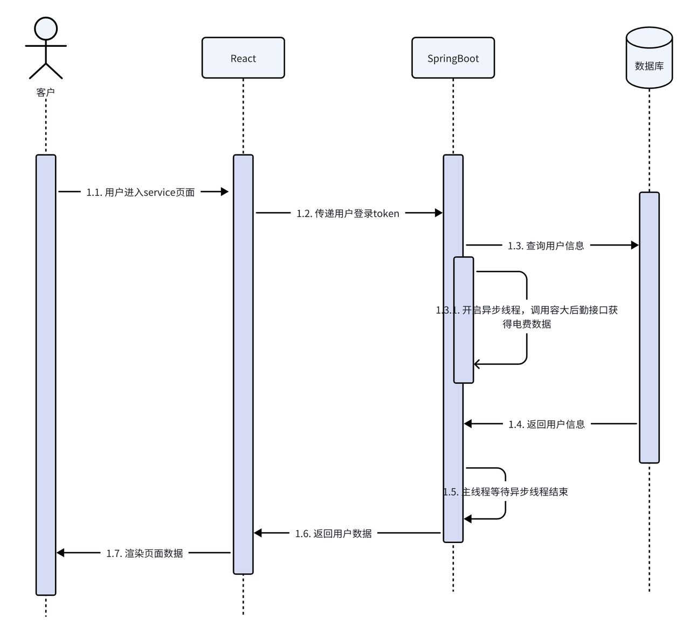
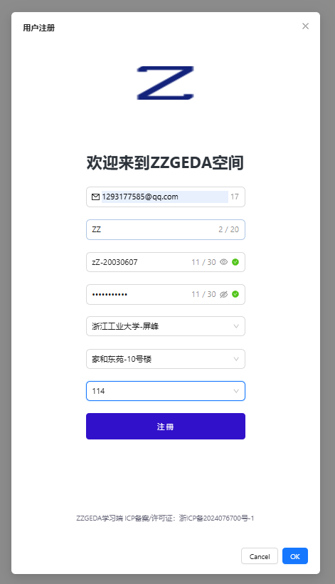

# 作者：ZZGEDA 张赞

# 项目所需的技术栈：
* SpringBoot
* Mybatis-Plus
* MySQL
* RabbitMq
* Redis
* OpenFien

# 项目架构&层级设计
🎯🎯🎯🎯🎯🎯🎯🎯🎯🎯🎯🎯🎯🎯🎯🎯🎯

    ├─src                               # 基于httpclient 向学校容大后勤服务发送请求 并基于Mq异步发送邮件  
    │  ├─main  
    │  │  ├─java   
    │  │  │  └─com   
    │  │  │      └─example  
    │  │  │          └─consumer   
    │  │  │              ├─config       # 配置类 包括Mybatis-Plus配置、MqJackson2JsonMessageConverter序列化、Httpclient配置     
    │  │  │              ├─controller   # controller 接口服务调用
    │  │  │              ├─convert      # convert dto、vo、po对象转换接口
    │  │  │              ├─exception    # exception 自定义异常和全局异常监听器    
    │  │  │              ├─listener     # listener Mq消息队列消费消息、包括exchange和queue的绑定  😻（关键）   （只有MailDirectQueueListener，其余的未使用）
    │  │  │              │  ├─MailDirectQueueListener       # MailDirectQueueListener 监听direct queue队列  😻（关键）
    │  │  │              ├─mapper       # mapper Mybatis-plus的数据库操作   
    │  │  │              ├─pojo         # pojo 自定义对象     
    │  │  │              │  ├─dto       # dto 数据传输层对象 层级之间信息传输对象   
    │  │  │              │  ├─entity    # entity 实体类型    
    │  │  │              │  ├─entity    # vo 接口出参  
    │  │  │              │  └─po        # po 持久层对象   
    │  │  │              ├─service      # service 核心服务   
    │  │  │              └─utils        # 工具包 封装了httpclient的请求、Mail邮件发送  😻（关键）   
    │  │  └─resources   
    │  │      └─mapper                  # mapper sql的xml文件封装   
    │  └─test                           # test 测试文件   
🚀🚀🚀🚀🚀🚀🚀🚀🚀🚀🚀🚀🚀🚀🚀🚀🚀

# 业务需求：
`邮件发送`：通过邮件，向用户发送宿舍的剩余电量  
`定时任务`：设定定时任务，间隔固定时间查询用户宿舍的剩余电量，当剩余电量低于阈值将自动发送邮件给用户   
`用户注册`：用户在注册页面注册，通过邮件实现注册信息的验证功能   
`用户可视的服务页面`:开发用户可视的前端页面，展示用户信息，同时用户可以勾选是否“订阅”的按钮，用户可以自主选择是否需要继续订阅电费邮件提醒服务   
👍👍👍👍👍👍👍👍👍👍👍👍👍👍👍👍👍

# 目标实现：
#####  1、向学校容大后勤的服务接口发起http请求，并解析json提取我们想要的字段数据  ✔
#####  2、基于SMTP协议，向用户发送Mail邮件  ✔
#####  3、由于发送邮件是一个耗时的业务，我们通过RabbitMq实现异步的Mail邮件发送  ✔
#####  4、定时任务，向容大后勤服务接口发送http请求，判断用户宿舍电费是否低于阈值  ✔  
#####  5、幂等校验，通过redis定时key缓存用户注册数据 同时使用list数据结构（栈）实现用户登录幂等校验 √ 
#####  6、用户注册的下拉列表接口完善，共计四个接口 √ 

# 项目业务流程图
### 用户注册
*   用户注册功能基于RabbitMQ实现异步的邮件的发送认证；
    使用Redis缓存用户注册信息，等待邮件校验通过再插入数据库。
    基于栈空间（list数据结构）实现同用户多次注册的幂等校验；最后基于sendRedirect重定向，重定向至“/service 服务页面”。
* 

### 主服务页面
*   用户进入“服务页面”，后端需要返回用户基本信息数据和宿舍电费数据。
    但是获取宿舍电费数据需要调用容大后勤API，这是个非常耗时的调用，如果是同步调用的话，用户等待的时间就会很长，这样用户的体验就不是很好。
    所以我在一个接口中开启异步线程，充分利用线程资源，优化响应速度。
* 

# 项目访问地址：
### http://8.130.14.29:23134/
### 登陆账号：1293177585@qq.com
### 登陆密码：zZ-001

### 用户注册
* 各位同学可以先按以下信息填写表单，体验服务（邮箱填自己的就好了，宿舍是我自己的宿舍）
* 

# 项目服务

*   - 项目后端地址：https://github.com/ZZGADA/Mq-UtilityBillService
*   - 项目前端地址：https://github.com/ZZGADA/UtilityBillService-FrontEnd
*   - 项目后端镜像：registry.cn-wulanchabu.aliyuncs.com/zzgeda/mail_sending_service:be_1.1.1
*        - 使用 docker pull 命令拉取镜像
*        - 使用 docker run -p 23135:18081 -d 镜像id 启动容器
*        - 启动命令：java -jar app.jar （无需手动输入，容器启动后自动启动SpringBoot服务）
*    - 项目前端镜像：registry.cn-wulanchabu.aliyuncs.com/zzgeda/mail_sending_service:fe_1.0.0
*        - 使用 docker pull 命令拉取镜像
*        - 使用 docker run -p 23134:3000 -d 镜像id 启动容器
*        - 启动命令：npm run start (无需手动输入，容器启动后自动启动React服务)

